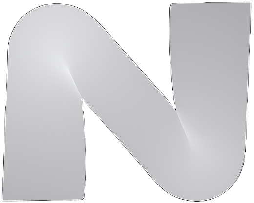

<div id="top">

<!-- HEADER STYLE: MODERN -->
<div align="left" style="position: relative; width: 100%; height: 100%; ">



<h1><strong>Notery</strong></h1>

<h3>Your Digital Notebook, Now with a Genius Co-Pilot.</h3>

<!-- BADGES -->
<!-- local repository, no metadata badges. -->

<h4>Built with the tools and technologies:</h4>

<em>Core Frameworks & Languages:</em>


<br>
<em>Backend & Database:</em>


<br>
<em>Frontend & UI:</em>


<br>
<em>AI & Machine Learning:</em>

<br>
<em>Tooling & Utilities:</em>


</div>
</div>
<br clear="right">

---


## ⚛️ Table of Contents

- [Overview](#-overview)
- [Features](#-features)
- [Project Structure](#-project-structure)
- [Getting Started](#-getting-started)
  - [Prerequisites](#-prerequisites)
  - [Installation](#-installation)
  - [Usage](#-usage)
- [Roadmap](#-roadmap)
  - [Core Functionality](#core-functionality)
  - [AI Enhancements](#ai-enhancements)
  - [Quality of Life](#quality-of-life)
- [Contributing](#️-contributing)
- [License](#-license)


---

<div align="center">

## 🔮 Overview

<strong>Notery</strong> is a powerful, <strong>full-stack</strong> web application that redefines the note-taking experience. Users can effortlessly create and manage their notes with a <strong>real-time, auto-saving editor</strong>. The standout feature is an integrated <strong>AI assistant</strong> that can answer questions and provide insights by analyzing the content across all of a user's notes. The app is built on a modern architecture featuring <strong>Next.js</strong> for the frontend and backend, <strong>Supabase</strong> for secure user authentication, and <strong>Prisma</strong> as the ORM for database interactions.

</div>

---

## 💫 Features

| Feature                 | Description                                                                                                                                                             |
| :---------------------- | :---------------------------------------------------------------------------------------------------------------------------------------------------------------------- |
| **📝 Real-Time Editor** | Create and edit notes with an auto-saving mechanism that updates your work every 1.5 seconds, ensuring you never lose your progress.                                         |
| **🤖 AI Assistant** | Ask questions and get intelligent answers based on the content of all your notes. The AI can analyze your entire collection to find information and provide insights. |
| **🔐 Authentication** | Secure user authentication system for signing up, logging in, and logging out, ensuring that your notes are private and accessible only to you. |
| **🔍 Fuzzy Search** | Quickly find the notes you're looking for with a powerful fuzzy search feature integrated into the sidebar.                                                                   |
| **🌓 Light/Dark Mode** | Switch between light and dark themes to match your preference and reduce eye strain. The theme is saved across your sessions.                                               |
| **📱 Responsive Design** | A fully responsive interface that works seamlessly on both desktop and mobile devices, providing a consistent experience everywhere.   |

---

## 🌌 Project Structure

```sh
.
├── README.md
├── components.json
├── next.config.ts
├── package.json
├── postcss.config.mjs
├── public
│   ├── Notery_Logo_Dark.png
│   └── Notery_Logo_Light.png
├── src
│   ├── actions
│   │   ├── notes.ts
│   │   └── users.ts
│   ├── app
│   │   ├── api
│   │   │   ├── create-new-note
│   │   │   │   └── route.ts
│   │   │   └── fetch-newest-note
│   │   │       └── route.ts
│   │   ├── favicon.ico
│   │   ├── layout.tsx
│   │   ├── login
│   │   │   └── page.tsx
│   │   ├── page.tsx
│   │   └── sign-up
│   │       └── page.tsx
│   ├── auth
│   │   └── server.ts
│   ├── components
│   │   ├── AppSidebar.tsx
│   │   ├── AskAIButton.tsx
│   │   ├── AuthForm.tsx
│   │   ├── DarkModeToggle.tsx
│   │   ├── DeleteNoteButton.tsx
│   │   ├── Header.tsx
│   │   ├── LogOutButton.tsx
│   │   ├── NewNoteButton.tsx
│   │   ├── NoteTextInput.tsx
│   │   ├── SelectNoteButton.tsx
│   │   ├── SidebarGroupContent.tsx
│   │   ├── ThemeLogo.tsx
│   │   └── ui
│   │       ├── alert-dialog.tsx
│   │       ├── button.tsx
│   │       ├── card.tsx
│   │       ├── collapsible.tsx
│   │       ├── dialog.tsx
│   │       ├── dropdown-menu.tsx
│   │       ├── input.tsx
│   │       ├── label.tsx
│   │       ├── separator.tsx
│   │       ├── sheet.tsx
│   │       ├── sidebar.tsx
│   │       ├── skeleton.tsx
│   │       ├── sonner.tsx
│   │       ├── textarea.tsx
│   │       └── tooltip.tsx
│   ├── db
│   │   ├── migrations
│   │   │   ├── 20250802100908_init
│   │   │   │   └── migration.sql
│   │   │   └── migration_lock.toml
│   │   ├── prisma.ts
│   │   └── schema.prisma
│   ├── hooks
│   │   ├── use-mobile.ts
│   │   └── useNote.tsx
│   ├── lib
│   │   ├── constants.ts
│   │   └── utils.ts
│   ├── middleware.ts
│   ├── openai
│   │   └── index.ts
│   ├── providers
│   │   ├── NoteProvider.tsx
│   │   └── ThemeProvider.tsx
│   └── styles
│       ├── ai-response.css
│       ├── globals.css
│       └── utils.ts
└── tsconfig.json


```

## ⚡ Getting Started

### 💠 Prerequisites

- [Node.js](https://nodejs.org/) (v18 or higher)
- [pnpm](https://pnpm.io/)

### 🔷 Installation

1.  **Clone the repository:**

    ```sh
    git clone [https://github.com/shahmir-zaman/notery.git](https://github.com/shahmir-zaman/notery.git)
    ```

2.  **Navigate to the project directory:**

    ```sh
    cd notery
    ```

3.  **Install the dependencies:**

    ```sh
    pnpm install
    ```

4.  **Set up your environment variables:**

    Create a `.env.local` file in the root of the project and add the following:

    ```
    DATABASE_URL="your_postgresql_database_url"
    SUPABASE_URL="your_supabase_url"
    SUPABASE_ANON_KEY="your_supabase_anon_key"
    OPENAI_API_KEY="your_openai_api_key"
    NEXT_PUBLIC_BASE_URL="http://localhost:3000"
    ```

5.  **Run the database migrations:**

    ```sh
    pnpm migrate
    ```

### 🔹 Usage

Run the development server with:

```sh
pnpm dev
```

Open [http://localhost:3000](http://localhost:3000) with your browser to see the result.

---

## 🌀 Roadmap

Here are some of the planned features and improvements for Notery. Contributions are welcome!

### **Core Functionality**
- [ ] **Rich Text Editing**: Implement a full rich text editor to allow for formatting options like **bold**, *italics*, `code blocks`, and lists within notes.
- [ ] **Note Organization**: Add the ability to create folders or apply tags to notes for better organization and filtering.
- [ ] **Note Sharing**: Allow users to share a read-only or editable version of a note via a public link or with another Notery user.
- [ ] **Export Options**: Add functionality to export single notes or all notes as Markdown (`.md`) or PDF files.

### **AI Enhancements**
- [ ] **AI-Powered Summarization**: Add a feature to have the AI generate a concise summary of a long note.
- [ ] **Contextual AI Suggestions**: As a user types, have the AI suggest relevant information from other notes in real-time.
- [ ] **AI Tagging**: Implement an AI feature that automatically suggests relevant tags for a note based on its content.

### **Quality of Life**
- [ ] **Improved Mobile UI**: Enhance the mobile sidebar and editor for a more intuitive experience on smaller screens.
- [ ] **Command Menu**: Add a command menu (e.g., accessible with `Ctrl+K`) for quick navigation and actions like creating a new note or searching.
- [ ] **Version History**: Allow users to view and revert to previous versions of a note.

---

## ✴️ Contributing

Contributions are what make the open-source community such an amazing place to learn, inspire, and create. Any contributions you make are **greatly appreciated**.

If you have a suggestion that would make this better, please fork the repo and create a pull request. You can also simply open an issue with the tag "enhancement".

1.  Fork the Project
2.  Create your Feature Branch (`git checkout -b feature/AmazingFeature`)
3.  Commit your Changes (`git commit -m 'Add some AmazingFeature'`)
4.  Push to the Branch (`git push origin feature/AmazingFeature`)
5.  Open a Pull Request

---
## ⭐ License

This project is dual-licensed.

For open-source and personal projects, Notery is licensed under the **AGPLv3**. You can view the full license text in the [LICENSE](LICENSE) file.

For commercial use in proprietary applications, a separate commercial license is required. Please contact [zshahmir5@gmail.com] for more information on obtaining a commercial license.

---
[back-to-top]: https://img.shields.io/badge/-BACK_TO_TOP-151515?style=flat-square


---
